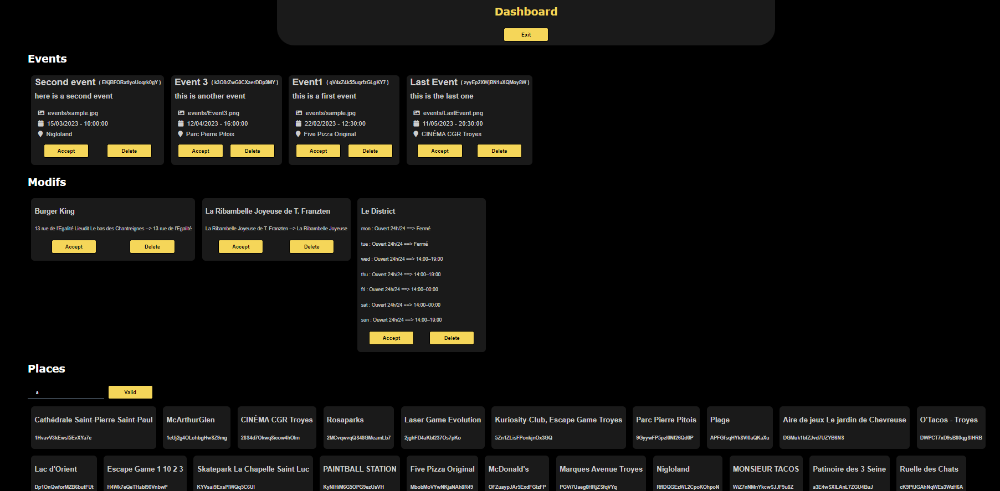
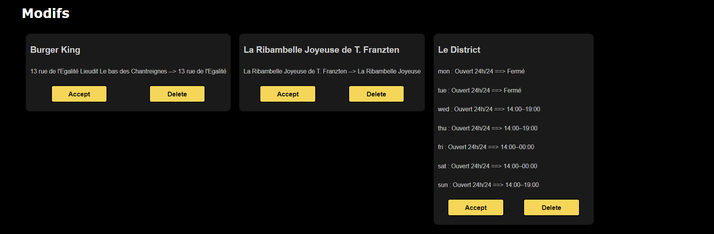

# Javascript to Firebase Dashboard

A web dashboard for managing the Firebase database for the mobile app "Troyes Xplore". The dashboard allows you to execute several deletion and addition operations with just a few clicks.

This is a NodeJs web app, Firebase operations are made using Javascript

## Overview

## Features

- Accept an event entered by a user or delete it

- Accept a modification suggested by a user or delete it

- Search for the document ID (on Firebase) of a place by its name

